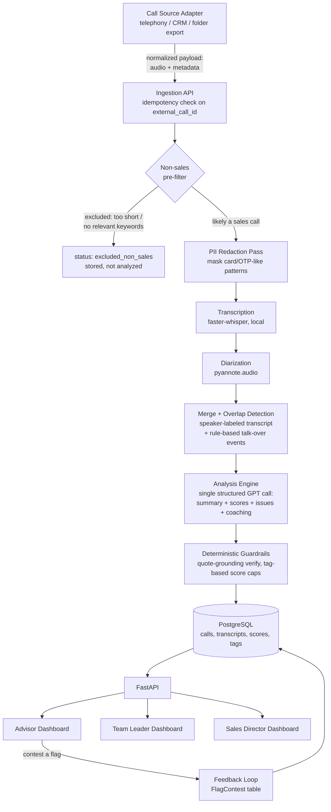
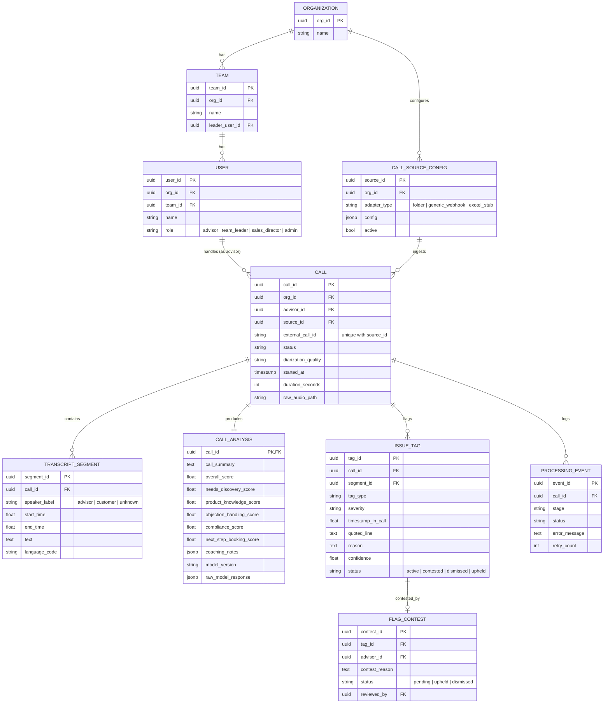

# FitNova Sales-Call Intelligence — Engineering Blueprint

**Purpose of this document:** a build roadmap, not a spec to admire. Every section exists to get you to a working, defensible prototype inside the time you actually have. No code — this tells you what to build, in what order, and why, so you understand every line you eventually write well enough to defend it live.

**The clock:** you received this at 13:40 on 10 Jul, deadline is 12 Jul 2PM — that's the stated 48 hours, almost to the minute. Budget realistically: ~6-8 hours will go to sleep/food/writeup/video, so treat this as a **~40-hour effective build window**. Everything below is sequenced so that if you run out of runway, you cut from the back of the roadmap, not the middle.

---

## 1. What This Assignment Is Actually Testing

Read literally, it's "build a call QA pipeline." Read carefully, it's testing four things simultaneously, and the rubric confirms it:

1. **Systems thinking under ambiguity** — they gave you a vague input ("a call source") and told you to design for vendor churn. They want to see if you reach for an abstraction (an adapter interface) or hardcode against one vendor. This is the single most-checked box in the whole brief — it's mentioned three separate times (ingestion, storage, submission).
2. **Judgment about where AI actually helps vs. where it's decoration.** The brief explicitly asks you to *justify prioritisation* of which stages get automated first. They're checking if you understand that transcription/tagging is commodity-easy now, and the actual hard problem is *trust* — stopping the model from inventing flags that could get an advisor unfairly penalized.
3. **Production instincts on a toy budget** — idempotency, retries, PII handling, non-sales-call gating. These aren't extra credit; they're literally listed as required edge cases. Skipping them reads as "junior."
4. **Honest self-assessment** — the README's real-vs-mocked split and the video's "where would this fail" are graded as heavily as the code. A polished demo with a dishonest README is a worse submission than a rough demo with a precise one.

Three personas (Sales Director, Team Leader, Advisor) are named explicitly — your data model and dashboards need to visibly serve all three, not just have "a dashboard."

---

## 2. Guiding Principles for This Build

- **One working seam beats five half-built ones.** At every phase checkpoint below, something end-to-end must run. Never let all pieces be simultaneously half-finished.
- **Mock the thing you can't get sandbox credentials for in 48h (telephony/CRM). Don't mock the thing that's the actual point of the assignment (analysis reliability).**
- **Every non-trivial design choice gets one sentence of "why," written down now, so it's not invented on the spot in the interview.** Section 17 collects these.
- **Don't build for FitNova's imagined future scale. Build for FitNova's stated current scale** (hundreds of advisors, org → teams → advisors) and make the schema *not require migration* to grow — that's different from over-provisioning infrastructure for it.

---

## 3. End-to-End Architecture

### 3.1 Pipeline Diagram



### 3.2 Stage-by-Stage Walkthrough

| Stage | What happens | Where automation is highest-leverage |
|---|---|---|
| **Ingestion** | A `CallSource` adapter normalizes whatever the vendor sends (webhook, polled folder, CRM export) into one shape: `{external_call_id, advisor_ref, customer_ref_hashed, audio_ref, started_at, duration}`. Idempotency check happens here, before anything expensive runs. | High — this is what currently doesn't exist at all (100% manual sampling), and it's the gate that makes everything downstream possible. |
| **Transcription + Diarization** | `faster-whisper` transcribes locally; pyannote diarizes; segments merged by timestamp overlap into a single speaker-labeled transcript. | High — replaces zero automated coverage with 100% coverage. This is the single biggest lever in the whole system: today, most calls are *never* reviewed. |
| **Analysis** | One structured LLM call (summary, scores, issue tags, and coaching notes in a single JSON response) against the full transcript, verified against deterministic guardrails before being trusted. | Medium-high — but *reliability engineering* here matters more than raw automation, because a wrong flag is worse than a missed one (it damages trust in the whole system and unfairly penalizes an advisor). |
| **Storage** | Normalized Postgres schema: org → team → advisor, call → transcript segments → scores → tags. | Not really an "automation" stage — it's the stage that makes the other automations *queryable and defensible*, which is why the assignment weights it as its own category. |
| **Surfacing** | Three role-scoped dashboard views over the same underlying data. | High leverage relative to effort — the same aggregation queries serve all three personas, so this is cheap to build once the data model is right. |
| **Feedback** | Advisor can contest a tag; Team Leader resolves it; resolution is stored, not silently discarded. | Lower automation, but non-negotiable — it's explicitly required, and it's the human-in-the-loop safety valve for an imperfect model. Do **not** try to auto-resolve contests with another LLM call — that's overengineering a problem that needs a human decision. |

**Prioritization argument (for your writeup):** ingestion and transcription/diarization go first because they convert "zero visibility" into "some visibility" — that's the highest-value jump. Analysis reliability (guardrails) comes next because a QA tool that's occasionally confidently wrong is *worse* than the manual status quo — it erodes trust and could get someone unfairly penalized. Dashboards and the contest loop come last in build order (not in importance) because they're the layer that turns "we have data" into "people act on the data," and they need real data underneath them to be worth building well.

---

## 4. Tech Stack & Justification

| Layer | Choice | Why |
|---|---|---|
| Transcription | **`faster-whisper`** (large-v3, local) as primary | Free and fast (CTranslate2-optimized Whisper), handles Hindi-English code-switching well out of the box. Keeps the cost model clean — the only paid API in the whole pipeline is the single OpenAI analysis call. `whisper.cpp` is a fine alternative if you want an even lighter footprint or no GPU at all. Don't use the hosted Whisper API — no reason to pay for transcription when a local model does the job for free. |
| Diarization | **pyannote.audio** (`pyannote/speaker-diarization-3.1`) | Matches your stated stack; runs on CPU for call-length audio (a few minutes of processing for a 10-15 min call), acceptable for batch/offline QA. |
| ⚠️ **Fallback (read this before Phase 0)** | **AssemblyAI or Deepgram (Nova-2)** — bundled STT + diarization in one API call | pyannote requires accepting gated model terms on HuggingFace and pulling a token — if that approval or local setup eats more than ~1 hour, **stop and switch**. A single-call hosted alternative removes your single biggest technical risk in a 48-hour window. Document the substitution honestly in the README as a deliberate time-constrained call, not a silent shortcut — that's a great trade-off to defend in the video. |
| Analysis | **OpenAI API**, GPT-4o-mini for dev iteration, upgrade to GPT-4.1/GPT-4o for final scoring if time/budget allow | Use Structured Outputs (`json_schema`, strict mode) or tool-calling to force schema-conformant output — don't parse free text. One single structured call per transcript returns summary, scores, issue tags, and coaching notes together (§8.3) — this is also the only paid API cost in the whole pipeline, now that transcription is local. Model tiering (cheap model while iterating prompts, better model for the final graded run) is a small, defensible engineering habit worth mentioning in the interview. |
| Backend | **FastAPI** | Given. Async-friendly for the I/O-bound pipeline (external API call to OpenAI). |
| Database | **PostgreSQL** | Given — and genuinely the right choice: this data is inherently relational (org→team→advisor, call→segments→scores→tags), and you need real aggregate queries (team averages, org rollups) that a document store makes awkward. |
| ORM | **SQLAlchemy** (`Base.metadata.create_all`, no migration tool) | For a 48-hour build there's no schema history to manage — just create tables directly on startup. Alembic is genuinely worth it in production once the schema needs to evolve after go-live, but adding it now is setup ceremony with no payoff inside this window. Worth one line in the README so it reads as a scoping call, not an oversight. |
| Dashboards | **Streamlit** | Given — fastest path to three functional, data-driven views without building a separate frontend. |
| Validation | Pydantic | Enforces the LLM's structured output shape before it ever touches the database. |
| Retry logic | `tenacity` | Decorator-based retry/backoff for every external API call — five minutes to add, and it directly answers the "vendor API failures with retries" requirement. |
| Quote verification | `rapidfuzz` (fuzzy substring match) | Used to verify a model-claimed quote actually exists in the transcript — see §8.4. |
| Containerization | Docker Compose for Postgres (and optionally the whole app) | Matches the submission requirement of "one clear command to run the demo." Don't containerize beyond this — a multi-service microservice split is the definition of overengineering here. |

---

## 5. Data Model

### 5.1 Entity-Relationship Diagram



### 5.2 Design Notes on the Schema

- **`org → team → advisor` scales without migration** because it's just three FK-linked tables, not hardcoded columns. Adding a new team is an `INSERT`, not a schema change — directly answers the "new teams/advisors added without manual reconfiguration" requirement.
- **`CALL_ANALYSIS` is deliberately a wide/denormalized table**, not a normalized `(call_id, dimension, score)` table. This is a conscious trade-off: the rubric's five dimensions are fixed by the assignment spec, so normalizing for "arbitrary future dimensions" is speculative generality you don't need yet. Say this explicitly if asked — it shows you *considered* normalization and rejected it for a reason, not that you didn't think of it.
- **`call_summary` and `coaching_notes` ride along in the same row**, not a separate table — they're 1:1 with a call, produced by the same single LLM call as the scores (§8.3), so there's no reason to split them out.
- **`(source_id, external_call_id)` has a unique constraint.** This is your idempotency mechanism — a webhook retry or a re-run of the folder watcher can never create a duplicate call record.
- **`ISSUE_TAG.segment_id` links a tag to the exact transcript segment it came from**, which is what makes quote-grounding verification (§8.4) possible.
- **`PROCESSING_EVENT` is your audit log and your resume-from-failure mechanism** — `call.status` is a state machine (`ingested → transcribing → diarizing → analyzing → scored | failed`), so a crash mid-pipeline resumes from the last completed stage instead of reprocessing (and re-billing) everything.

---

## 6. Ingestion Layer (Source-Agnostic Design)

The brief is explicit: FitNova may switch or run multiple telephony/CRM vendors, and ingestion must be source-agnostic. The way to prove this in 48 hours isn't to integrate three real vendors — it's to build **one clean interface and two implementations**, one real, one stubbed:

- **`CallSource` (abstract interface):** defines `fetch_new_calls()` → normalized payloads, and `get_audio(ref)` → bytes. Any vendor becomes "implement these two methods."
- **`FolderSource` (real, used for your demo):** polls/watches a folder of `audio + metadata.json` pairs — this *is* your mocked CRM export, and it's real code that really runs.
- **`GenericWebhookSource` (real):** a FastAPI endpoint that accepts a normalized payload shape, proving you can also ingest push-based (webhook) delivery, not just pull-based.
- **`StubExotelSource` (stub, interface-conformant):** method bodies raise `NotImplementedError` with a docstring describing exactly what the real Exotel API call would be. This proves the abstraction holds without you burning hours on a vendor sandbox you can't get in time.

This is the single highest-leverage design decision in the whole assignment relative to the hour it costs — it directly answers one of the three explicitly-named grading angles.

---

## 7. Transcription & Diarization

1. `faster-whisper` (local) produces a transcript with word/segment-level timestamps — no API call, no per-minute cost.
2. pyannote produces speaker-turn segments (`speaker_A`: 0.0–4.2s, `speaker_B`: 4.2–9.8s, …) with per-segment confidence.
3. **Merge by maximum time-overlap:** for each `faster-whisper` segment, assign it to whichever pyannote speaker cluster overlaps it most. This is the standard, low-complexity way to combine the two tools — don't build anything fancier than this for MVP.
4. **Map anonymous clusters (`speaker_A`/`speaker_B`) to `advisor`/`customer` roles** using a simple heuristic: the advisor typically speaks first and has a longer average turn length in the opening 30 seconds (pitching vs. responding). Confirm/correct this heuristic against your sample calls before trusting it.
5. **Overlap detection** (for the `talking_over_customer` tag) is computed here, deterministically, from segment timestamps — *not* left to the LLM to eyeball from a transcript. If speaker_A's segment and speaker_B's segment overlap by more than ~500ms, log a talk-over event with its timestamp. Feed these events to the LLM as pre-computed evidence rather than asking it to infer timing from text — this is a good example of "use the LLM for judgment, not for arithmetic it's bad at."

---

## 8. Analysis Engine

### 8.1 Scoring Rubric

Five dimensions, each scored 0–10, rolling up into a weighted `overall_score`:

| Dimension | Weight | Anchor definition |
|---|---|---|
| Needs Discovery | 25% | Did the advisor ask about the customer's goals, current fitness level, budget, and timeline *before* pitching a plan? |
| Compliance | 25% | Absence of over-promising, undisclosed costs, or pressure tactics. |
| Objection Handling | 20% | Were customer concerns (price, time, skepticism) acknowledged and addressed, not dismissed or steamrolled? |
| Product Knowledge | 15% | Accurate, specific description of the program that matches the customer's stated needs. |
| Next-Step Booking | 15% | Did the call end with a concrete, scheduled next step (specific date/time), not a vague "we'll follow up"? |

**Why Compliance and Needs Discovery are weighted highest:** these are the two dimensions that protect the company from the exact risk named in the brief — "mis-selling... goes unnoticed until a customer complains." Next-Step Booking is weighted lowest of the five because it's partly outside the advisor's control (a well-run call can still end without a booking if the customer genuinely needs to think it over) — penalizing it as heavily as compliance would mis-align incentives.

**Rollups:** advisor average = mean of their calls' `overall_score` over a rolling window (e.g., trailing 30 days); team average = mean of its advisors' averages; org average = mean of team averages. Compute these at query time in the dashboard queries — don't build a separate materialized aggregation pipeline for a dataset this small; that's premature optimization.

**Guardrail — don't fully trust the LLM's own compliance number.** If a `critical`-severity tag (e.g. `over_promising`) is present on a call, algorithmically cap `compliance_score` at a low ceiling (e.g. 3/10) in code, regardless of what the model self-reported. This is a deterministic check layered on top of LLM judgment, and it's a genuinely good interview answer to "how do you make the scoring consistent?"

### 8.2 Issue-Tag Taxonomy

| Tag | Trigger | Default severity | Detection approach |
|---|---|---|---|
| `no_needs_discovery` | Advisor pitches a plan before asking about goals/budget/fitness level | High | LLM (content judgment) |
| `over_promising` | Absolute/guaranteed outcome claims ("guaranteed results," "you'll definitely lose X kg") | Critical | LLM (content judgment) |
| `pressure_or_urgency` | Manufactured urgency not tied to a real, verifiable fact ("this offer is only for the next 10 minutes") | High | LLM (content judgment) |
| `price_before_value` | Cost is stated before the program's value/benefits are explained | Medium | LLM (content judgment, sequence-aware) |
| `undisclosed_costs` | A price is mentioned without disclosing mandatory add-on fees later revealed or never mentioned | High | LLM (content judgment) |
| `weak_or_missing_trial_booking` | Call ends without a specific date/time for a trial session | Medium | LLM (content judgment) |
| `talking_over_customer` | Repeated speech overlap between advisor and customer | Medium | **Rule-based** (timestamp overlap, §7) confirmed/contextualized by LLM |

Every tag instance carries `timestamp_in_call`, `quoted_line`, and `reason` — required by the brief and required by your own quote-grounding verification (§8.4).

### 8.3 Prompting & Structured Output Strategy

**One structured call per transcript, not two.** A single GPT call takes the full diarized transcript (plus the pre-computed talk-over events from §7) and returns one JSON object covering everything: call summary, rubric scores, issue tags, and coaching notes. This halves the cost and latency versus separate scoring/tagging calls, and there's no real quality loss — all four sections are judgments over the same transcript context, and a well-specified `json_schema` (strict mode) keeps each section internally consistent even when generated together. It's also simpler to maintain: one prompt, one schema, one call to retry.

Illustrative output shape (not code):

```json
{
  "is_sales_call": true,
  "summary": "2-3 sentence plain-language recap of what happened on the call",
  "scores": {
    "needs_discovery": {"score": 7, "rationale": "..."},
    "product_knowledge": {"score": 8, "rationale": "..."},
    "objection_handling": {"score": 6, "rationale": "..."},
    "compliance": {"score": 9, "rationale": "..."},
    "next_step_booking": {"score": 5, "rationale": "..."}
  },
  "issues": [
    {"tag_type": "price_before_value", "severity": "medium", "timestamp": 142.5, "quoted_line": "...", "reason": "...", "confidence": 0.82}
  ],
  "coaching": ["One or two concrete, specific suggestions the advisor could act on next call"]
}
```

The system prompt states the five rubric anchor definitions (§8.1) and the full tag taxonomy (§8.2) together, plus 1-2 short few-shot examples. Output is forced via OpenAI Structured Outputs (`json_schema`, strict mode) straight into a single Pydantic-validated shape — no free-text parsing. `is_sales_call` doubles as the secondary non-sales-call safety net described in §10.

**Determinism:** temperature 0, pinned model version logged per call in `CALL_ANALYSIS.model_version` — this is what lets you say "we can explain exactly why any historical call got the score it did" if asked.

**On chunking long calls:** still don't build it for MVP. Sales calls run 5-20 minutes; even a generous transcript is well under the ~128k-token context window of GPT-4.1/4o-mini, so the whole call fits in a single request — with more headroom now that one call replaced two. Note in your writeup that chunking with overlapping windows is the documented next step *if* FitNova's calls ever run much longer (e.g., enterprise sales calls) — this shows you scoped the decision rather than missed the concern.

### 8.4 Anti-Hallucination Safeguards ("reliable tagging")

This is the section of the assignment most reviewers will probe hardest, because it's the actual hard problem, not the tooling.

1. **Quote-grounding verification.** For every tag the model returns, programmatically fuzzy-match (`rapidfuzz.fuzz.partial_ratio`, threshold ~90) `quoted_line` against the actual transcript text. If no segment matches above threshold, **discard the tag** and log it to `PROCESSING_EVENT` as a rejected-hallucination event (useful for a "we rejected N hallucinated tags out of M" number in your video — that's a strong, concrete number to cite).
2. **Confidence field is used, not decorative** — surface low-confidence tags differently in the dashboard (e.g., a "needs review" badge) rather than treating every tag as equally certain.
3. **Deterministic caps** on scores from critical tags (§8.1) mean the LLM's numeric self-report is never the sole source of truth for the highest-stakes number.
4. **The contest workflow (§13) is your final human-in-the-loop safety net** — no automated system claiming 100% precision on a subjective judgment call is credible; the honest answer is "we verify what we can verify programmatically, and give humans an explicit, logged path to override the rest."

---

## 9. API Design (FastAPI)

| Endpoint | Purpose |
|---|---|
| `POST /webhooks/ingest/{source_type}` | Push-based ingestion entrypoint for webhook-style adapters |
| `POST /calls/upload` | Manual/dev ingestion — upload audio + metadata JSON directly (your demo's primary entry point) |
| `GET /calls` | List with filters: advisor, team, date range, status, has-active-flags |
| `GET /calls/{call_id}` | Full detail: transcript, scores, tags |
| `POST /calls/{call_id}/reprocess` | Idempotent retry from last-failed stage |
| `GET /calls/{call_id}/transcript` | Diarized transcript |
| `GET /calls/{call_id}/analysis` | Scores + tags |
| `POST /calls/{call_id}/tags/{tag_id}/contest` | Advisor contests a flag |
| `POST /admin/tags/{tag_id}/resolve` | Team Leader upholds/dismisses a contest |
| `GET /dashboards/org-summary` | Sales Director aggregates |
| `GET /dashboards/team-summary/{team_id}` | Team Leader aggregates |
| `GET /dashboards/advisor-summary/{advisor_id}` | Advisor's own view |
| `GET/POST /orgs/{org_id}/teams` | Team management |
| `POST /teams/{team_id}/advisors` | Add advisor to a team |
| `GET /health` | Liveness check |

**Auth:** a simple role-header or JWT-with-role-claim is enough for the demo. Note in the README that a production system would sit behind proper SSO/RBAC — don't build that now, it's pure overengineering for a take-home.

---

## 10. Edge Cases & Error Handling

| Edge case | Handling |
|---|---|
| Mono recording / poor diarization | pyannote confidence below threshold (or one cluster spans >90% of duration) → mark `diarization_quality = 'low'`, store transcript with `unknown` speaker labels, suppress turn-taking-dependent tags (`talking_over_customer`), still run content-based tags but flag them with a "speaker attribution unverified" caveat in the UI. |
| Hindi-English code-switching | `faster-whisper` handles multilingual/code-switched audio well natively — no special handling needed for transcription. Tag `language_code` per segment for analytics. Explicitly instruct the analysis prompt that content may be code-switched and this is normal, not a compliance issue. |
| Non-sales calls (wrong number, internal) | Cheap pre-filter (duration < ~20s and/or absence of any product/plan keywords) routes straight to `excluded_non_sales` before any LLM call runs. Secondary safety net: the single analysis call itself returns an `is_sales_call: bool` field (§8.3); if false, discard scores/tags and mark excluded. Saves cost and avoids nonsense flags. |
| PII exposure | Regex-based redaction pass masks card numbers, OTP-like digit sequences, and similar patterns **before the transcript is sent to the third-party LLM API** — this is a genuine data-handling concern, not just a display nicety. Full names/phone numbers can remain for internal analysis but should be redacted in any exported/shared view. |
| Hallucinated/false-positive tags | Quote-grounding verification (§8.4) — discard ungrounded tags, log the rejection, surface confidence, back it with the contest workflow. |
| Vendor API failures | `tenacity`-wrapped retry with exponential backoff (e.g. 3 attempts: 2s/4s/8s) around the OpenAI analysis call (and the diarization API, only if you switched to the AssemblyAI/Deepgram fallback). Transcription is local now, so it isn't a network failure point. `call.status` state machine means a crash mid-pipeline resumes from the last completed stage. |
| Duplicate ingestion (webhook retries) | Unique constraint on `(source_id, external_call_id)` with upsert-ignore-on-conflict semantics — a call can never be double-processed even if the vendor delivers the same webhook twice (common at-least-once delivery behavior in real telephony systems). |

---

## 11. Real vs. Mocked

Be exactly this blunt in your README — reviewers explicitly reward honesty here.

**Real:**
- `faster-whisper` transcription and pyannote diarization (or the AssemblyAI/Deepgram fallback, if you took that path — say so plainly)
- Full analysis pipeline: one structured call for summary, scoring, tagging, and coaching notes, quote-grounding verification, deterministic score caps
- Postgres schema, fully implemented via SQLAlchemy (`create_all`, no migration tool — see §4)
- FastAPI backend, all endpoints in §9 functional
- Streamlit dashboards querying live Postgres data
- Contest/feedback workflow, end to end
- Idempotent ingestion and resumable pipeline

**Mocked (and why):**
- Live telephony/CRM vendor integration (Exotel/Knowlarity/Salesforce) — no sandbox credentials achievable in 48 hours. Replaced with a `FolderSource` adapter that ingests audio+metadata pairs shaped exactly like a real vendor export/webhook would be, proving the adapter pattern rather than one vendor's SDK.
- Full RBAC/SSO — a simplified role header stands in for what would be a real identity provider in production.
- Notifications (e.g., Slack alert to a Team Leader on a critical flag) — out of scope; a log line stands in if you have five spare minutes, otherwise mention it as an obvious V2.

---

## 12. Dashboards

All three views query the same underlying tables — build one shared `Call Detail` page (transcript + inline flag markers + scores) and reuse it across personas; only the top-level aggregate view differs per role.

| View | Contents |
|---|---|
| **Advisor** | My calls list (each row showing the AI-generated summary as a quick preview), my score trend over time, per-dimension breakdown, coaching notes from my calls, active flags with a "contest" button, my resolved contest history |
| **Team Leader** | Team roster with per-advisor average + trend sparkline, team-wide tag distribution by type/severity, drill-down into any advisor's calls, pending contests queue to resolve |
| **Sales Director** | Org-wide KPIs: calls processed, average quality trend, top issue tags org-wide, team leaderboard, unresolved critical-flag count, filterable by date/team |
| **Call Detail (shared)** | AI-generated call summary at the top; diarized transcript with color-coded flag markers at their timestamps; click a flag to see quoted line + reason + severity; coaching notes below the transcript |

Audio playback synced to transcript is a nice-to-have if time allows at the very end — not a Phase-1-through-6 priority.

---

## 13. Feedback / Contest Loop

- Advisor sees an active tag on their call → clicks contest → `FlagContest` row created with `status = pending` and a free-text reason.
- Team Leader sees pending contests in their dashboard → resolves as `upheld` (tag stays active) or `dismissed` (tag's status flips to `dismissed`, excluded from that advisor's rollups going forward).
- **Do not** auto-resolve contests with another LLM call — the whole point of this loop is a human decision on a disputed judgment call. Automating it away defeats its purpose and is exactly the kind of overengineering to avoid.

---

## 14. Project Directory Structure

```
callsight-ai/
├── README.md                          # setup, run command, real-vs-mocked, known limitations
├── docker-compose.yml                 # Postgres (+ app, optional)
├── .env.example
├── requirements.txt
├── app/
│   ├── main.py                        # FastAPI entrypoint, router registration
│   ├── config.py                      # pydantic-settings, env vars
│   ├── db/
│   │   ├── session.py                 # engine/session factory
│   │   ├── models.py                  # ORM models (§5)
│   │   └── crud.py                    # reusable data-access functions
│   ├── ingestion/
│   │   ├── base.py                    # CallSource abstract interface
│   │   ├── folder_source.py           # real adapter: folder of audio+json pairs
│   │   ├── generic_webhook_source.py  # real adapter: normalized webhook payload
│   │   ├── stub_exotel_source.py      # interface-conformant stub, documents real integration
│   │   └── registry.py                # source_type -> adapter class mapping
│   ├── pipeline/
│   │   ├── orchestrator.py            # drives status state machine, handles retries
│   │   ├── transcription.py           # Whisper wrapper
│   │   ├── diarization.py             # pyannote wrapper + confidence gating
│   │   ├── pii_redaction.py           # regex/NER masking pre-LLM and pre-display
│   │   └── overlap_detector.py        # rule-based talk-over event detection
│   ├── analysis/
│   │   ├── prompts.py                 # system prompt: rubric anchors, tag taxonomy, few-shots
│   │   ├── schemas.py                 # single Pydantic schema: summary/scores/issues/coaching
│   │   ├── analyzer.py                # the one structured GPT call (§8.3)
│   │   ├── guardrails.py              # quote-grounding verification + deterministic score caps (§8.1, §8.4)
│   │   └── non_sales_gate.py          # cheap pre-filter heuristic, runs before the analyzer
│   ├── api/
│   │   ├── routes_calls.py
│   │   ├── routes_ingestion.py
│   │   ├── routes_org.py
│   │   ├── routes_dashboards.py
│   │   ├── routes_contest.py
│   │   └── deps.py                    # auth/role + db session dependencies
│   └── utils/
│       ├── retry.py                   # tenacity decorators
│       └── logging.py                 # structured logging setup, writes to logs/pipeline.log
├── dashboard/
│   ├── Home.py                        # Streamlit entrypoint, role switcher
│   ├── pages/
│   │   ├── 1_Sales_Director.py
│   │   ├── 2_Team_Leader.py
│   │   ├── 3_Advisor.py
│   │   └── 4_Call_Detail.py
│   └── charts.py
├── scripts/
│   ├── seed_demo_data.py              # orgs/teams/advisors + backfilled historical calls
│   └── run_pipeline_once.py           # CLI: point at one file, run full pipeline (Phase 1 + video demo)
├── sample_calls/                      # demo audio + metadata fixtures
├── logs/
│   └── pipeline.log                   # stage transitions, retries, rejected-hallucination events
└── tests/
    ├── test_idempotency.py
    └── test_quote_grounding.py
```

---

## 15. Implementation Roadmap (Phased, Hour-by-Hour)

Each phase ends with a stated **milestone** — if you're behind schedule, you stop at the last completed milestone and it's still a legitimate, working demo of *something*.

| Phase | Hours | Work | Milestone |
|---|---|---|---|
| **0 — Setup & risk retirement** | 0–2 | Repo scaffold, Docker Compose Postgres, API keys, **pull pyannote's gated model immediately** (or make the AssemblyAI/Deepgram call now if it's not approved fast), gather/synthesize 3-5 sample two-speaker sales-call audio clips | The riskiest dependency (diarization) is resolved one way or another |
| **1 — Pipeline spine** | 2–8 | `run_pipeline_once.py`: audio → `faster-whisper` → pyannote → merged diarized transcript, printed to console | Point the script at any audio file, get a correct speaker-labeled transcript |
| **2 — Analysis engine** | 8–14 | Prompt design, single structured output schema, one merged GPT call, quote-grounding verification against the Phase-1 transcript | One call produces validated JSON: summary + scores + verified tags + coaching notes |
| **3 — Persistence + ingestion** | 14–20 | Postgres schema (SQLAlchemy `create_all`, no migration tool), `CallSource` interface + `FolderSource`, idempotency check, wire pipeline to write real rows | Drop a new audio+metadata pair in the folder → fully processed, stored call, no duplicates on rerun |
| **4 — API layer** | 20–26 | FastAPI endpoints from §9 | Swagger UI can walk the entire loop end to end |
| **5 — Dashboards** | 26–34 | Three Streamlit views + shared Call Detail page | All three personas navigable, showing real data from 3-5+ processed calls |
| **6 — Edge-case hardening** | 34–40 | Non-sales gate, PII redaction, retry/idempotency polish, low-confidence diarization fallback, one intentionally-broken test call | Feed a deliberately bad input, show it degrades gracefully instead of crashing |
| **7 — Seed realistic demo data** | 40–44 | `seed_demo_data.py`: multiple advisors/teams, enough historical calls that dashboards look populated, not empty | Dashboards tell a believable org-level story, not "one test call" |
| **8 — README, writeup, video** | 44–48 | Final polish, one-command run verification, 2-minute video (script from §17) | Submission-ready |

**If you fall behind, cut in this order (last cut first):** video polish → dashboard visual polish → seed-data variety → edge-case hardening breadth (keep at least 2 of the 7 edge cases demoably handled) → the `StubExotelSource` (a code comment describing it is enough) → never cut Phases 1-4, they're the core loop the "working prototype" grading criterion is checking for.

---

## 16. What Impresses vs. What's Overengineering

**High-leverage, cheap to build — do these:**
- The `CallSource` adapter pattern, even with just one real + one stub implementation
- Quote-grounding verification as a concrete, describable anti-hallucination mechanism
- Idempotency via the unique constraint + resumable status state machine
- Deterministic score caps layered on top of LLM judgment
- The contest/feedback workflow, actually functional end to end
- A concise AI-generated call summary and per-call coaching notes — essentially free (they're just two more fields in the same structured output, §8.3) but they make the Team Leader/Sales Director views immediately scannable without opening a full transcript
- A precise, honest real-vs-mocked README section
- A tight, specific 2-minute video that names real trade-offs and a real failure mode

**Overengineering — actively avoid these:**
- Kubernetes or a multi-service microservice split — one FastAPI app + Streamlit + Postgres is plenty
- Building real Exotel/Knowlarity SDK integrations — use their documented payload shape as a reference, mock the sender
- Fine-tuning a custom model for tagging — prompt engineering on an off-the-shelf model comfortably clears this bar
- Real-time streaming transcription — this is a retrospective QA tool, not a live-call assist product; batch is what's actually asked for
- Full SSO/RBAC — a role header is enough to demonstrate the concept
- A message broker (Celery/Redis) — FastAPI background tasks or even synchronous processing is sufficient at this scale
- A vector DB / cross-call semantic search — not asked for; per-call analysis doesn't need it (a good "V2 idea to mention, not build" line for the video)

---

## 17. Interview Defense — Trade-off Talking Points

Have a one-sentence answer ready for each of these before the call, not invented live:

- **"Why Postgres over a document store?"** The data is inherently relational (org→team→advisor, call→segments→scores→tags) and the whole point is aggregate rollup queries, which relational joins do naturally and a document store makes awkward.
- **"Why not real-time transcription?"** This is a retrospective coaching/QA tool — the value is in aggregated trends and flagged calls for review, not live intervention. Real-time would be a different product with a different cost profile.
- **"Why verify quotes instead of trusting the model?"** A false `over_promising` flag directly damages an advisor's reputation and comp — the cost of a wrong flag is asymmetric, so a cheap programmatic check against ground truth is worth the extra code.
- **"How do you know your scores are consistent across calls?"** Pinned model version, temperature 0, rubric-anchored few-shot examples, and deterministic caps on scores tied to critical tags — the same discipline a human QA team uses to calibrate raters, just automated.
- **"What happens when diarization is unreliable?"** Confidence-gated fallback — turn-taking-dependent tags are suppressed rather than asserted on shaky evidence; content-based tags still run but are marked with a caveat.
- **"Why the adapter pattern for ingestion?"** FitNova explicitly said they may switch or run multiple telephony/CRM vendors — a thin common interface means adding a vendor is additive, not a pipeline rewrite.
- **"What would break first at real scale (hundreds of advisors, thousands of calls/day)?"** Be honest: synchronous LLM calls in the request path would need to move to a real background worker queue, and the schema would need connection pooling / read replicas for dashboard query load — say this proactively, it reads as foresight, not a gap.

---

## 18. Final Requirement-to-Implementation Checklist

| Assignment requirement | Addressed in |
|---|---|
| Ingestion (source-agnostic) | §6, §14 (`ingestion/`) |
| Transcription & diarisation | §7 |
| Analysis (scoring + flagging) | §8 |
| Storage | §5, §11 |
| Surfacing (dashboards) | §12 |
| Feedback loop | §13 |
| Diagram + written walkthrough | §3 |
| Justify automation prioritisation | §3.2, §15 |
| Scoring rubric + org/team/advisor rollups | §8.1 |
| Issue-tag taxonomy | §8.2 |
| Reliable tagging (structured, anti-hallucination) | §8.3, §8.4 |
| Timestamp + quoted line + reason per flag | §8.2, §8.4 |
| Edge cases (mono/diarization, code-switching, non-sales, PII, hallucination, API failures) | §10 |
| Rich, source-agnostic input/output, scalable org model | §5, §6 |
| Working prototype, full loop | §15 (Phases 1-4), §11 |
| README: real vs. mocked | §11 |
| Video walkthrough | §15 (Phase 8), §17 |
| Dashboards (brownie points) | §12 |
| AI-generated call summary + coaching notes (your enhancement) | §8.3, §12 |
| Completeness of thought | Whole document |
| Depth of understanding / defend trade-offs | §17 |
